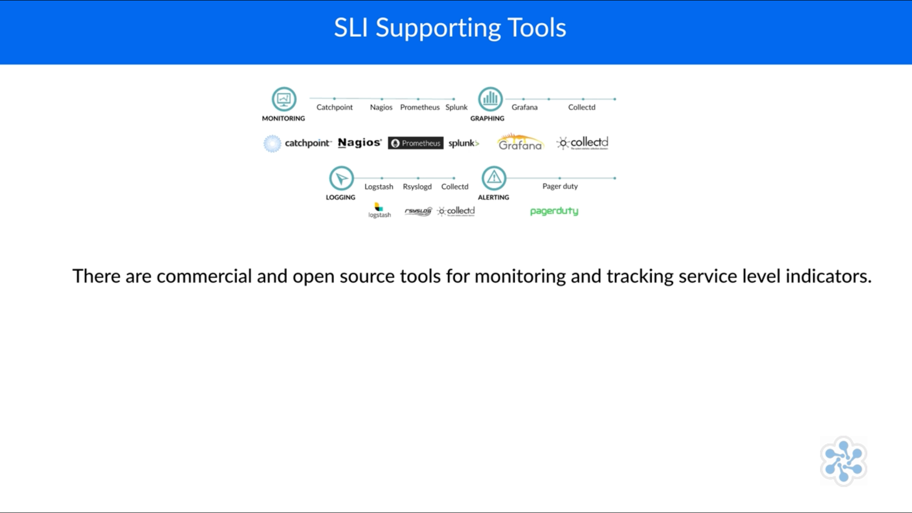

# SRE Foundations

[course link](https://cloudacademy.com/course/site-reliability-engineering-sre-foundation-introduction-1044)

## SRE Principles and Practices

### What is Site Reliability Engineering

- Created at Google around 2003 and publicized via the [SRE Book](https://learning.oreilly.com/librry/view/-/9781491929117/) and the [SRE Workbook](https://learning.oreilly.com/library/view/-/9781492029496/) and [Seeking SRE](https://learning.oreilly.com/library/view/seeking-sre/9781491978856/)
- SRE is a discipline that incorporates **aspects of software engineering** and applies them to **infrastructure** and **operations problems**.
- [Google resources](https://landing.google.com/sre)
- The goal is to create ultra-scalable and highly reliable distributed software system.
- SRE's spend 50% of their time doing ops related work such as issue resolution, on-call and manual interventions.
- SRE's spend 50% of their time on development tasks such as new features, scaling or automation.
- Monitoring and alerting are key to SRE.

SRE is now spread well beyond Google and many organizations are adopting SRE principles.

[SRE Weekly](https://sreweekly.com/)

## SRE and DevOps, What's the Difference?

- DevOps is a set of practices, guidelines and culture designed to breakdown silos in IT development and operations, architecture, network and security.
- SRE is a set of practices that Google has developed to manage services at scale.

### DevOps 5 Key Pillars of Success

1. Reduce organizational silos
2. Accept failure as normal
3. Implement gradual changes
4. Leverage tooling and automation
5. Measure everything

### SRE and its Principles

1. Operations is a software problem
   1. The basic tenet of SRE is that doing operations well is a software problem.
   2. SRE should therefor use software engineering approaches to solve that problem.
   3. Software engineering as a discipline focuses on designing and building rather than operating and maintaining.
2. Service Levels
   1. SLO(Service Level Objectives) is an availability target for a product or service(this is **never** 100%).
   2. SRE services are managed by SLOs.
   3. SLI(Service Level Indicators) are the metrics that are used to measure the service.
   4. SLA(Service Level Agreement) specifies a target level of service for the reliability of your service.
   5. SLO(Service Level Agreement) business contract that comes into effect when your users are so unhappy you have to compensate them in some fashion.
3. Toil
   1. Any and all manual, mandated operational task is bad
   2. If a task can be automated, it should be automated.
   3. Tasks can provide the "wisdom of production" that will inform better system design and behavior
   4. SREs must have time to make tomorrow better than today.
4. Automation
   1. Automate what is currently done manually
   2. Decide what to automate and how to automate it
   3. Take an engineering-based approach to automation and tasks rather than just toiling at them over and over.
   4. This should dominate what an SRE does.
   5. Do not automate a bad process - Fix the process first.
   6. Sometimes in SRE we talk about, "automating ourselves out of a job" - this is a good thing.
5. Reduce cost of failure
   1. Late problems (defect) discovery is expensive so SRE looks for ways to avoid this
   2. Look to improve MTTR(Mean Time to Recovery) and MTBF(Mean Time Between Failures)
   3. Smaller Changes = Smaller Failures
   4. Canaries and Blue-Green deployments are ways to reduce the cost of failure.
6. Shared Ownership
   1. SREs share skill sets with product development teams
   2. Boundaries between "application development" and "production"(Dev & Ops) should be removed.
   3. SREs "shift left" and provide "wisdom of production" to development teams.
   4. In SRE we encourage **more** engineers to have experience of production deployments, **not less**
   5. No one team or individual should become the ops team.

> 💡 "Shift left" is a practice in software development that involves integrating important development practices, such as testing, quality assurance (QA), and security measures, earlier in the software development lifecycle (SDLC). The phrase is also known as "Start Left" and is a central pillar of DevOps and DevSecOps.

## SRE Service Level Objectives and Error Budgets

### What is a SLO?

- A Service Level Objective is a goal for how well a product or service should operate
- SLOs are tightly linked to user experience
  - If the SLOs are being met then the user will be happy
- Setting and measuring service level objective is a key aspect of the SRE role
- The most widely tracked SLO is availability
- Products and services could and should have multiple SLOs
- We use SLIs to measure if we are meeting our SLOs
- Monitoring tool or service will provide the data used for checking compliance against the SLOs
- 99.9% of web requests should be successful
  - If there are 1 million requests, 1000 can fail and this is an **error budget**
- Failure to hit an SLO must have consequences. If more than 1000 requests fail in a month the some remedial action must be taken. And this is an **error budget policy**

> 💡 SLO's are the most important component of SRE. They are the key to understanding how well a service is performing and how well it is meeting the needs of its users.

According to the [2023 Catchpoint](./docs/catchpoint.pdf) the things that teams are monitoring or measuring are:

1. Availability/Uptime: 78%
2. Performance/Response Times: 71%
3. Latency: 64%
4. Error Rates: 64%
5. Throughput(MBs or requests per second): 48%
6. Unauthorized Requests: 29%
7. Saturation: 25%

Availability is the same thing as uptime, e.g. does a service respond to a request?

Response time is the total time it takes from when a user makes a request until they receive a response.

Latency is the delay incurred in communicating a message(the time a message takes to travel from the sender to the receiver).

## SRE Error Budgets

> 💡 100% is the wrong reliability target for basically everything.

[Risk and Error Budgets](https://dominiquehallan-links.com/risk-and-error-budgets)

### Error Budgets: Good and Bad

- **Bad**
  - We have error budgets in SRE as
going over budget usually means
someone somewhere will have to
work over-time or respond to
out-of-hours issues
Not hitting 99.9% of HTTP
requests in a month usually
means scalability issues so "ops"
need to do something
- **Good**
  - On the other hand SRE practices
encourage you to strategically burn
the budget to zero every month,
whether it's for feature launches or
architectural changes
This way you know you are running
as fast as you can (velocity) without
compromising availability

### Error Budgets: Fixed?

The negotiation to relax the SLO error budget bridges the gap and improves communication and understanding between Dev and Ops and the business. Watch out for high-risk deployments or large big-bang changes because they have a likelihood of issues and therefore more chance to blow the error budget.

This should encourage the lean preference for small, incremental changes. In some cases the error budget may need to change to accommodate complex releases but this needs to be agreed upon by Dev and Ops and the business

### Error Budget Policies

Missed SLO's have noticeable consequences on business performance:

- Lost Revenue: 70%
- Drop in Employee productivity: 57%
- Lost Customers: 49%
- Social Media backlash: 36%

> There will be no new feature launches allowed. Sprint planning may only pull post-mortem action items from the backlog. Software engineering teams must meet with SRE team daily to outline their improvement plans.

- As an example HB could have a availability SLO of 99.9%
- Every month this allows for 43 minutes of outages
- New feature releases, patches, planned and un-planned downtime need to fit into this 43 minutes

| Number of Nines | Availability (%) | Downtime per Year               | Downtime per Month      | Downtime per Week       | Downtime per Day       |
|-----------------|------------------|---------------------------------|-------------------------|-------------------------|------------------------|
| 1               | 90.0             | 36 days, 12 hours               | 72 hours                | 16 hours, 48 minutes    | 2 hours, 24 minutes    |
| 2               | 99.0             | 3 days, 15 hours, 36 minutes    | 7 hours, 12 minutes     | 1 hour, 40 minutes      | 14 minutes, 24 seconds |
| 3               | 99.9             | 8 hours, 45 minutes, 36 seconds | 43 minutes, 12 seconds  | 10 minutes, 4.8 seconds | 1 minute, 26.4 seconds |
| 4               | 99.99            | 52 minutes, 33.6 seconds        | 4 minutes, 19.2 seconds | 1 minute, 0.48 seconds  | 8.64 seconds           |
| 5               | 99.999           | 5 minutes, 15.36 seconds        | 25.92 seconds           | 6.048 seconds           | 0.864 seconds          |

**Notes**:
- Downtime per Year is based on 365 days per year.
- Downtime per Month is based on 30 days per month.
- Downtime per Week is based on 7 days per week.
- Downtime per Day is based on 24 hours per day.

### Discussion: What error budget policies would you use to enforce an availability SLO?

1. Minimize deployment downtime
2. Minimize infrastructure outages
3. Address Scalability and performance issues

How could you achieve these?

- cloud automation
- cloud immutable infrastructure
- load balancing
- caching
- zero downtime deployments
- A/B deployments
- Canary deployments

## The VALET Dimension of SLO

| Dimension      | SLO                                                           | Budget                                                       | Policy                                                                                        |
|----------------|---------------------------------------------------------------|--------------------------------------------------------------|-----------------------------------------------------------------------------------------------|
| Volume/Traffic | Does the service handle the right volumes of data or traffic  | Budget 99.99% of HTTP requests per month succeed with 200 OK | Address scalability issues                                                                    |
| Availability   | Is the service available when needed                          | Budget 99.9% availability/uptime                             | Address downtime issues/outages, zero downtime deployments                                    |
| Latency        | Does the service deliver in a user-acceptable period of time? | Payload of 90% of HTTP responses returned in under 300ms     | Address performance issues, caching, load balancing                                           |
| Errors         | Is the service delivering the capabilities being requested?   | 0.01% of HTTP requests return 4xx or 5xx status codes        | Analyze and respond to main status codes, new functionality or infrastructure may be required |
| Tickets        | Are  our support services efficient?                          | 75% of service tickets are automatically resolved            | Automate more manual process                                                                  |

---

## SRE Reducing Toil

### What is Toil?

> 💡 Toil is the kind of work tied to running a production service that tends to be manual, repetitive, automatable, tactical, devoid of enduring value, and that scales linearly as a service grows. - Vivek Rau

[SRE Book - Eliminating Toil](https://landing.google.com/sre/sre-book/chapters/eliminating-toil/)

## You might have toil if you have processes that are

- **Manual**:
  - This includes work such as manually running a script that automates some task. Running a script may be quicker than manually executing each step in the script, but the hands-on time a human spends running that script (not the elapsed time) is still toil time.
- **Repetitive**:
  - If you’re performing a task for the first time ever, or even the second time, this work is not toil. Toil is work you do over and over. If you’re solving a novel problem or inventing a new solution, this work is not toil.
- **Automatable**:
  - If a machine could accomplish the task just as well as a human, or the need for the task could be designed away, that task is toil. If human judgment is essential for the task, there’s a good chance it’s not toil.21
- **Tactical**:
  - Toil is interrupt-driven and reactive, rather than strategy-driven and proactive. Handling pager alerts is toil. We may never be able to eliminate this type of work completely, but we have to continually work toward minimizing it.
- **No enduring value**:
  - If your service remains in the same state after you have finished a task, the task was probably toil. If the task produced a permanent improvement in your service, it probably wasn’t toil, even if some amount of grunt work—such as digging into legacy code and configurations and straightening them out—was involved.
- `O(n)`**with service growth**:
  - If the work involved in a task scales up linearly with service size, traffic volume, or user count, that task is probably toil. An ideally managed and designed service can grow by at least one order of magnitude with zero additional work, other than some one-time efforts to add resources.

### Manual Toil

1. Interrupts(non-urgent service-related messages and emails)
2. On-call (urgent) responses
3. Releases and pushes

### Ways to Reduce Manual Toil

- automated deployments
- Approving deployments by automation through tools like Slack
- Connecting to infrastructure to monitor some metric, moving from "eyes on glass" to "monitoring as code"

## Repetitive toil

- Doing the same test over and over
- Acknowledging the same alert every morning
- Dealing with interrupts

### Ways to Reduce Repetitive Toil

- Automate the testing
- Automate the alerting that is meaningful
- Automate the response to the alert

## Toil is not 🙅‍♀️

1. Regular work
2. Making improvement
3. Toil must include service under management
4. Creative experimentation to solve a problem or create a solution may be repetitive but its not toil

## Why is Toil Bad?

| Impact of High Toil | Individuals | Organizations|
|---------------------|-----------|--------------|
| Slow Progress | Manual work and firefighting (toil) takes up the majority of time | New features do not get released quickly, missed value opportunity. Shortage of team capacity|
| Poor Quality | Manual work often results in mistakes, time consuming to fix, impact on reputation | Excessive costs in support of services |
| Career Stagnation | Career progression is limited, no time for learning new skills | High staff turnover, loss of knowledge and experience |
| Attritional | Toul is demotivating meaning people start looking elsewhere | Staff turnover results in extra costs and lost knowledge |
| Unending | Never ending deluge of manual tasks, no time to find solutions, more time spent managing backlog of tasks than fixing them | Toil requires engineering effort to fix. If there is no engineering time available it won't be fixed. SLA's being breached |
| Burnout | Personal and heath problems due to overload and disruptive work patterns | Potential for litigation and negative press |

### Engineering Bankruptcy

"Engineering bankruptcy" highlights the problem of unaddressed toil. Unaddressed toil can go critical, forming a chain reaction, where the future is nothing but toil. It ends up taking so much of everyone's til and effort to the point where there is no capacity left to do anything about it.

Future products and services cannot be developed or improved, stifling innovation and resulting ultimately in the failure of the business.

## Doing something about Toil

> SRE is what happens when you ask a software engineer to design an operations team.

1. Manual releases - toil reduced by creating external automation to do automated releases.
2. Manually scaling infrastructure bil reduced by using external automation such as cloud bi sed auto scalers to perform the
required scaling
3. Manual password resets - toil reduced by enhancing the service to be offered up as a self-service feature
4. Extracting data - toil reduced by using internal automation such as a database query via a feature/tool so users can again self-serve this.

## Work we do

- Daily
  - Jenkins
  - AWS Permission Grants
- Every week
  - DevSecOps table
- Every now and then
  - AWS Security Group
  - AWS IAM Review
- Never but should
  - New builds
  - Enhancements that are not things on 🔥

## Make Engineering Time Available

- Google has an advertised goal of keeping work toil to 50% of an SRE's time
- At least 50% of each SRE's time should be spent on engineering tasks that will reduce toil or add service features
- 50% rule ensure that one team/s or individual/s do not become the ops team

## Move Towards SRE at Slack

- Slack moved from 100 AWS instances to 15K instances over 4 years
- Excessive toil caused by low-quality, noisy alerting.
- Ops team consumed by interrupt-driven toil that they were unable to make progress on improving reliability
- Slack explicitly committed to the importance of reliability over feature velocity
- Operational ownership of services pushed back into the dev teams resulting in the teams making the code fixes
necessary to stop the incident alerts

## Is it worth Automating Everything?

- There are cost and benefits associated with the engineering effort when automating away toil
- You need to consider the engineering investment vs
the payback once the toil has been removed
- Consider for example a 5 year life of a service, if you do something every week and it takes you 1 minute to do it e.g. acknowledging a Monday morning disk space alert, then you have a budget of up to 4 hours to automate that task away. If it takes longer than 4 hours to automate it the it's probably not worth the effort.

[Pragmatic Automation](https://dominiquehallan-links.com/4cfdbWo)

## SRE Monitoring & Service Level Indicators

[Implementing SRE Practices on Azure](https://dominiquehallan-links.com/3XsiAoG)

## What do you monitor?

- User Count
- CPU Utilization
- Disk Space Utilization
- Memory Utilization
- Network Utilization
- Disk I/O
- Network I/O
- Latency
- Error Rates
- Uptime

Maybe your monitoring is less technical and more about what makes users happy - again as an example maybe the user doesn't care if disk space is running out, but instead they only care that there is a problem preventing them from completing their "transaction".

## SLI (Service Level Indicators)

> 💡 SLIs are ways for engineers to communicate quantitative data about systems.

A common thread running throughout this learning path is that there should be a single source of the truth that everyone across the organization can trust Monitoring tools provide such a mechanism to collect and aggregate various datapoints, which are then used to derive SLI information.

With these considerations in mind - how do they translate into into SLIs. - which equates to technically speaking, monitoring - and then onto SLOs- which as we know now, focus on the user experience.

We need to specify our SLOs and then use the monitoring at our disposal to check our SLI's to make sure we are not breaching SLOs.

## SLI Measurement

While many numbers can function as an SLI, it is generally recommended
to treat the SLI as the ratio of two numbers: the number of good events divided by the total number of events.

Considering our previous example, this then equates to: Number of successful (HTTP) web requests / total (HTTP) requests (success rate).

This calculation should be performed continually on current data, and of which allows us to aggregate it over time and cross check and measure it against a stated service level objective (SLO).

Many indicator metrics are naturally gathered on the server side, using a monitoring system such as Prometheus, or with periodic log analysis-for instance, HTTP 500 responses as a fraction of all requests.

Some service level indicators may also need client-side data collection, because not measuring behavior at the client can miss a range of problems that affect users but don't affect server-side metrics.

- SLI measurement needs also to be time-bound in some way
- The time horizon may vary depending on the organization and the SLO
- For web requests per month, the time horizon is clear SLOs such as "successful bank payments" may require a broader horizon if bank payments are only made once or twice per month.

Mapping SLOs to SLIs is simple:

We use monitoring tools to measure SLIs constantly, aggregating across
suitable time periods. We use our calculated SLIs to tell us if we are meeting our defined SLOs or not-they also tell us how much of our error budget is left (if any).

## Monitoring

- Monitoring is the process of collecting, aggregating, and displaying data about the performance and availability of a system.
- Telemetry is the highly automated communications process by which measurements are made and other data collected at remote or inaccessible points and transmitted to receiving equipment for monitoring.
- APM (Application Performance Monitoring) is a subset of monitoring that focuses on the performance of applications.

SLOs define the "level of service" expected and SLIs show the "level of service" delivered.

> 💡 "We need to make sure that monitoring is effective without drowning in a sea of non-actionable alerts. The path to success is to instrument everything,but only monitor what truly matters" - Todd Palino

As the scale and reach of your services and infrastructure grows, then so does
the amount of required monitoring, to the point where we have an "ocean" of alerts.

> 💡 SLOs need to be focused on the user experience, not the tech

## Observability

- Observability is a measure of how well internal states of a system can be inferred from knowledge of its external outputs.
- Monitoring is focused on things that we anticipate will go wrong, creating thresholds of acceptable behavior and alerts when they are breached.
- In Observability, we don't respond to individual alerts since we are constantly observing and reacting to the current state of the service.
- If the current state begins to degrade in any way then we can proactively respond to that.
- Monitoring on the other hand waits for an outage to take place
and then informs us that something has happened.

[Additional Resources](https://dominiquehallan-links.com/3z7g2Ck)

We want to improve alerting through SRE by having user-facing SLOs that are measured through SLIs.

## Better Monitoring

1. Traditional monitoring tools set a static threshold for each metric. Every time that threshold is breached, you received one alert. This can add up to having too many alerts. A better approach is to generate one alert for a group of metrics associated with a system or application - like a host or a database.
2. Machine learning techniques can be applied to your monitoring data to offer you an idea of how your environment normally performs, making it easier to separate true alerts from false ones. This is the "normal" state.
3. The final step to improving your signal-to-noise ratio is utilizing multi-criteria alerting. In short, by increasing the number of specific conditions you set on an alert rule, the less likely it is
to trigger.

[Additional Resource](https://dominiquehallan-links.com/4aYYcyP)

## What Observability Looks Like

- Distributed tracing: Is about getting data about a service that spans multiple components and microservices.
- Event logging:  Provides a standard, centralized way for applications (and the operating system) to record important software and hardware events.
- Internal performance data: Can be extracted from APM (application performance management) tools, giving details of how the application itself is performing.
- User experiences: Involves understanding the user journey and what makes it successful.
- Fewer paging alerts: Because we know what "normal" service looks like, and only alert if "normal" is degraded.
- Ask what/if questions:  For example if we take a server out of action, what would be the impact on the user experience?

Observability is all about collecting the datapoints that allow you to ask questions of the health of the service, proactively. Enabling you to check that things are okay, rather than waiting for and reacting to alerts and outages.

> "This rich ecosystem of introspection and instrumentation is not particularly biased towards the traditional monitoring stack's concerns of actionable alerts and outages."

## SRE Tools & Automation

Automation is a key part of SRE. It is the process of using technology to make a system operate automatically. Automation is used to reduce manual intervention, reduce human error, and improve efficiency.

- Consistency - a machine will be more consistent than a human.
- A platform upon which to build - automation can be used to build more automation.
- Speed - automation can be faster than a human.
- Reliability - automation can be more reliable than a human.

### Automation Requires
- A problem to be solved:
  - Eliminate toil
  - Improve SLOs
- Appropriate tools:
  - Configuration management
  - Orchestration
  - Monitoring
  - Alerting
- Engineering effort:
  - Time to design and build
  - Time to test
  - Time to deploy
- Measurable outcomes:
  - Reduced toil
  - Improved SLOs

